exclude: true
<style type="text/css">
code.r{
  font-size: 16px;
}
pre {
  font-size: 16px !important;
}
</style>
```{r setup, include=FALSE}
options(htmltools.dir.version = FALSE)
```
---
class: split-two
<link rel="stylesheet" href="https://cdnjs.cloudflare.com/ajax/libs/font-awesome/4.7.0/css/font-awesome.min.css">
.column.bg-main1[
.font2.comfortaa.coral[Resumen año 2019: I `r anicon::faa('heart', animate='pulse', size=1,color='red')` `r anicon::faa('r-project', animate='bounce', size=1,color='#165CAA')` forever!!!]<br><br>
.font_large.comfortaa[`r anicon::faa('python', animate='pulse', size=2,color='#165CAA')` `r anicon::faa('js-square', animate='pulse', size=2,color='yellow')` buuu!! `r anicon::faa('thumbs-down', animate='float', size=1,color='red')`]
</br></br></br></br>
.font2.comfortaa[Francisco Zambrano  Bigiarini <br><br> Investigador en .yellow[Hémera]<br>]
.font1.comfortaa[`r anicon::faa('link', animate='vertical', rtext='&nbsp;hemera.umayor.cl', color='white')` <br>]

.font_large.comfortaa[`r anicon::faa('github', animate='pulse', rtext=' frzambra', color='white')` <br> `r anicon::faa('twitter', animate='pulse', rtext=' @frzambra', color='00acee')`<br>`r anicon::faa('envelope', animate='spin', rtext=' francisco.zambrano@umayor.cl', color='white')`<br>]
.font_large.comfortaa[Resumen 2019, Hémera, Santiago, Chile</br>
19 Diciembre, 2019]
</br>
<!-- .font_large[`r anicon::faa('link', animate='vertical', rtext='&nbsp;https://bit.ly/2nMINjf', color='white')` -->
<!-- ] -->
]
.column.bg-main3.center[
</br></br>
.vmiddle[]
]

```{r include=FALSE}
library(mapview)
library(sf)
pivB <- st_read('/mnt/Compartido/Penhology-production/data/vectorial/pivot_big.gpkg')
pivS <- st_read('/mnt/Compartido/Penhology-production/data/vectorial/pivot_small.gpkg')
predios <- st_read('data/spatial/predios_merge.gpkg')
kiwis <- st_read('data/spatial/cuarteles_kiwis.gpkg')
pts <- st_read('data/spatial/puntosmuestreo.shp')
```
<!-- --- -->
<!-- class: bg-main1 -->

<!-- # Why am I here? -->

<!-- -- -->
<!-- ### Teach you how to code in R `r emo::ji("x")` -->

<!-- -- -->
<!-- ### Teach you how you *should* use R `r emo::ji("heavy_check_mark")` -->

<!-- -- -->
<!-- ### Teach you how to make writing R code enjoyable `r emo::ji("heavy_check_mark")` -->

<!-- -- -->
<!-- ### Teach you how to learn R `r emo::ji("heavy_check_mark")` -->

<!-- --- -->
<!-- class: middle bg-main1 -->

<!-- # How most academics learn R -->

<!--  -->

<!-- --- -->
<!-- class: middle bg-main1 -->

<!-- # How .yellow[should] you use R? -->

---
layout: true
---
class: split-two with-border border-white fade-row2-col1

.column[
  .split-two[
  .row.bg-main1[.content.font2[
Investigador `r icon::fa('user-secret',color='green',size=2)` 
  ]]
  .row.bg-main2[.content.font2[
Académico `r icon::fa('user-tie', size=2,color='red')`]]
]

.column.bg-main1[.content.center.vmiddle[


]]

---
class: bg-main1, center, middle

# Lineas de Investigación

---
layout: false
class: bg-main1

# Linea de Investigación 1: .yellow[Sequía] agrícola en Chile

.font2.comfortaa[Déficit de .yellow[precipitación] persistente en la zona .yellow[Centro-Sur] de Chile desde el año 2007.]

.center[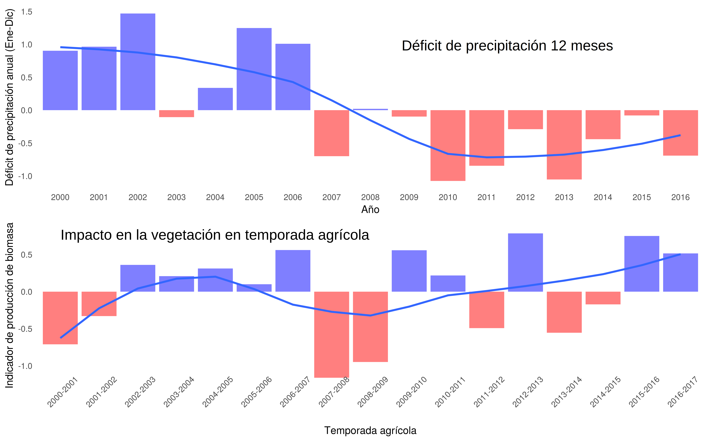]

---
class: bg-main1

# .yellow[Proxy] de biomasa 

.font2.comfortaa[Considera el acumulado en la temporada]

.center[]

---
class: bg-main1

# Análisis a dos escalas

.font2.comfortaa[
- .yellow[Regional:] 
  - Índices de vegetación (MOD13Q1, 250m, 16 días)
  - Landcover y Fenología (MCD12Q1, MCD12Q2, 500m, anual)
  - Precipitación (CHIRPS v2, 5km, diario; MSWEP 10km, diarios)
  - Evapotranspiración (MOD16A2, 500m, 8 días)

- .yellow[Local:] 
  - Sentinel 2(A/B) (10-60m, 5 días)
  - Landsat 7/8 (30m, 16 días)
]

---
layout: false
class: bg-main1

# Regional


.center[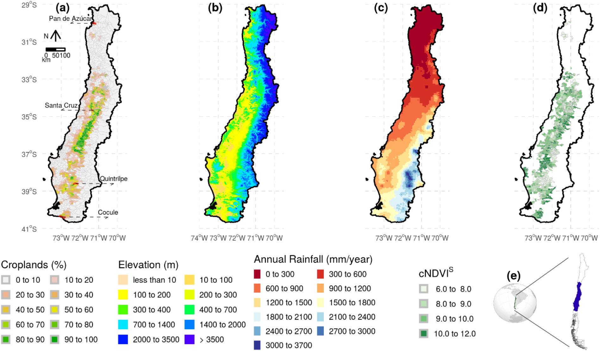
]

---
layout: false
class: bg-main1

# Regional


.center[<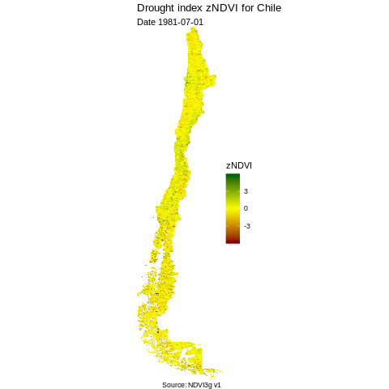]

---
layout: false
class: bg-main1

# Local

## Pivotes con maíz: temporadas 2006-2007 y 2007-2008
```{r echo=FALSE,message=FALSE,warning=FALSE,fig.width=15}
pivots <- st_union(pivB,pivS)

mapview(pivots,map.types = 'Esri.WorldImagery')
```

---
layout: false
class: bg-main1
# Local

.center[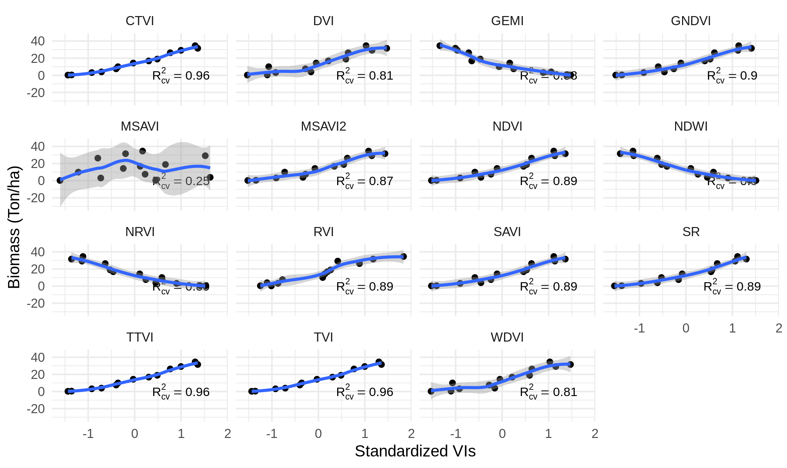]

---
layout: false
class: bg-main1
# Local 
## Predios con trigo y maíz temporadas 2018 al 2022

```{r echo=FALSE,message=FALSE,warning=FALSE,fig.width=15}

mapview(predios,map.types = 'Esri.WorldImagery')
```

---
layout: false
class: bg-main1

# Linea de Investigación 2: .yellow[Estado hìdrico] en frutales

.center[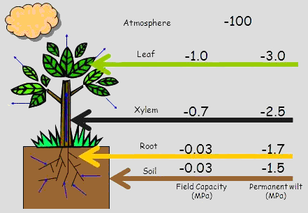]

---
layout: false
class: bg-main1

# Potencial hídrico en la hoja

$$\Phi =\Phi_t + \Phi_\pi$$

## Potencial total

.center[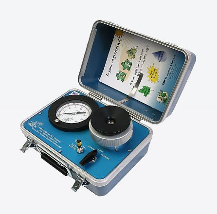]

## Potencial de turgor

.center[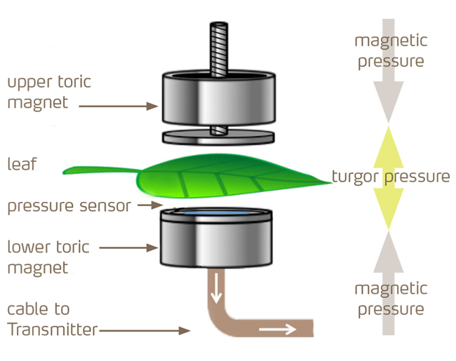]

---
layout: false
class: bg-main1

# Liceo Agrícola El Carmen, San Fernando, Región de O'Higgins

```{r echo=FALSE,message=FALSE,warning=FALSE,fig.width=15}

mapview(kiwis,map.types = 'Esri.WorldImagery',alpha.regions =1) +
  mapview(pts)
```
---
layout: false
class: bg-main1

#Indicadores Vegetacionales temporadas 2018-2019 y 2019-2020

.center[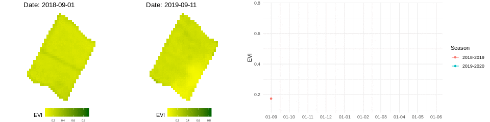]
.center[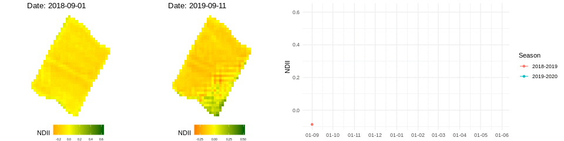]

---
layout: false
class: bg-main1

#Repositorio en Github

.center[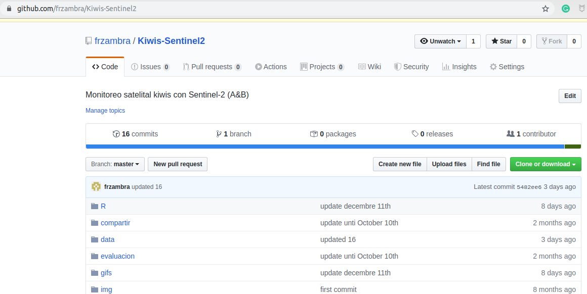]

---
layout: false
class: bg-main1

#Repositorio en Github

.center[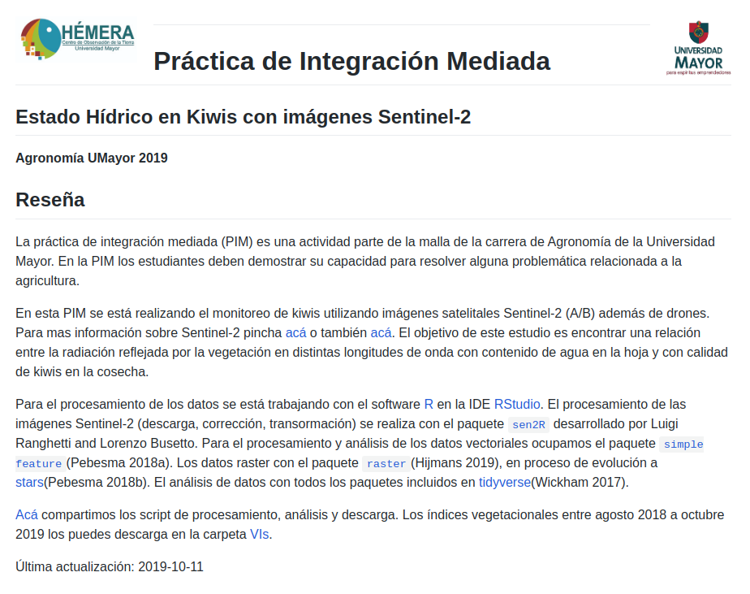]

---
class: bg-main1, center, middle

# Conferencias

---
layout: false
class: bg-main1

# American Meteorological Society (AMS)

.font2.comfortaa[
.yellow[Ubicación:] USA, Boston  
.yellow[Fecha:] 4 de Octubre 2019  
.yellow[Tipo de presentación:] oral  
.yellow[Sesión:] Quantifying impact of weather extremes in a changing climate: drought and agriculture.

**Zambrano, F.** Vrileing, A., Nelson, A., Meroni, M.,Tadesse, T. (2019). Prediction of seasonal agricultural productivity anomalies derived from MODIS data for the cultivated land of Chile. In 2019 Joint Satellite Conference – AMS Committee on Satellite Meterology, Oceanography, and Climatology, EUMETSAT, and NOA, September 28-October 4, Boston, USA.
]

---
layout: false
class: bg-main1

# Latin `r anicon::faa('r-project', animate='flash', size=1,color='#165CAA')`

.font2.comfortaa[
.yellow[Ubicación:] Universidad Católica, Santiago, Chile  
.yellow[Fecha:] 27 de Septiembre 2019  
.yellow[Tipo de presentación:] oral  
.yellow[Sesión:] Modelos predictivos

**Zambrano, F.** Predicción de la sequía agrícola en Chile: regresión lineal vs deep learning]

---
class: bg-main1, center, middle

# Revisor 

---
layout: false
class: bg-main1

#Revisiones 

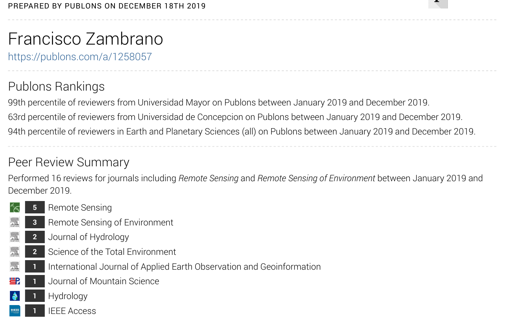

---
layout: true
---
class: split-two with-border border-white fade-row2-col1

.column[
  .split-two[
  .row.bg-main1[.content.font2[
Investigador `r icon::fa('user-secret',color='green',size=2)` 
  ]]
  .row.bg-main2[.content.font2[
Académico `r icon::fa('user-tie', size=2,color='red')`]]
]

.column.bg-main1[.content.center.vmiddle[


]]

---
class: bg-main1, center, middle

# Prácticas de Integración Mediada

---
layout: false
class: bg-main1

# Tres durante el 2019

.font2.comfortaa[
.yellow[Primer Semestre:]   
  (1) Estado hídrico en Kiwis usando imágenes Sentinel 2  
  (2) Calidad en Kiwis utilizando imagenes de UAV

.yellow[Segundo Semestre:]  
  (1) Estado hídrico en Kiwis usando imágenes Sentinel 2 (Cont.)
]

---
class: bg-main1, center, middle

# Proyectos de Títulos

---
layout: false
class: bg-main1

# Eficiencia de riego, heladas y demanda de agua

.font2.comfortaa[
.yellow[Título:] Evolución de las heladas para el periodo 2010-2019 en la región del Maule, Chile.  
.yellow[Alumna:] Kenya Andrea Cabañas Casanova  
.yellow[Término:] 27 de diciembre 2019  
]

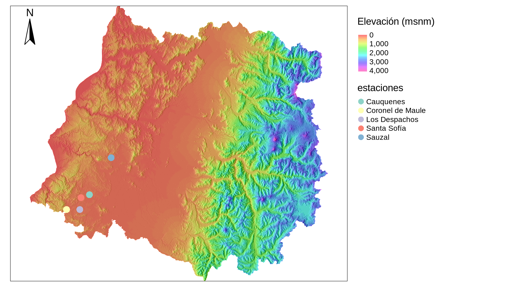

---
layout: false
class: bg-main1

.font2.comfortaa[
.yellow[Título:] Análisis de la tendencia de la evapotranspiración de referencia en la región de Ñuble 2000-2019  
.yellow[Alumna:] Isidora Pacheco Ruíz  
.yellow[Término:] 27 de diciembre 2019  
]

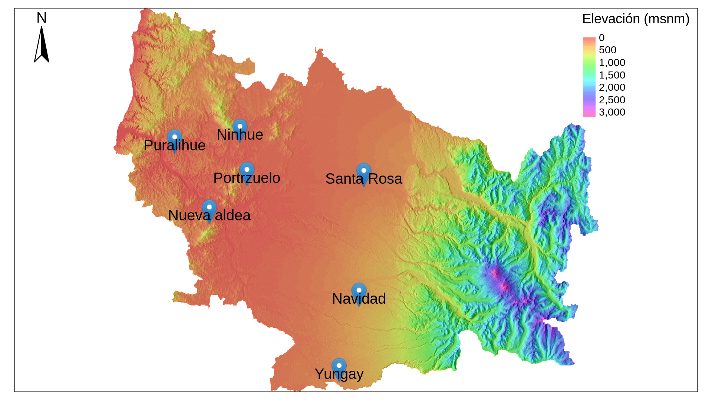

---
layout: false
class: bg-main1

.font2.comfortaa[
.yellow[Título:] Eficiencia de riego como medida de adaptación a una sequía agrícola en Chile. Caso de Estudio: Región de O'Higgins.  
.yellow[Alumno:] Matías Lafrentz  
.yellow[Término:] 27 de diciembre 2019  
]

---
class: bg-main1, center, middle

# Bonus!!!

---
background-image: url("slide_img/rmDEM.gif")
background-position: center
background-size: contain

# DEM Región Metropolitana

<!-- .center[] -->

---
background-image: url("slide_img/saluteYou.gif")
background-position: center
background-size: contain

##For those about to .red[code] in `r anicon::faa('r-project', animate='bounce', size=3,color='#165CAA')` we salute you!!

<!--  -->

